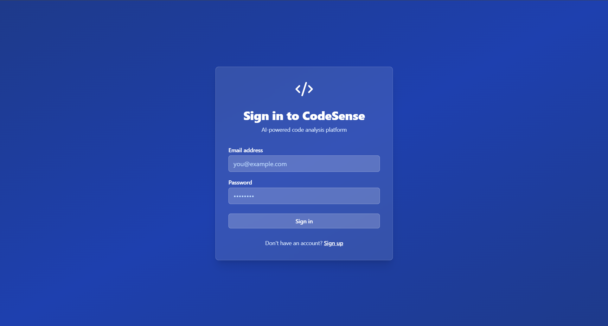
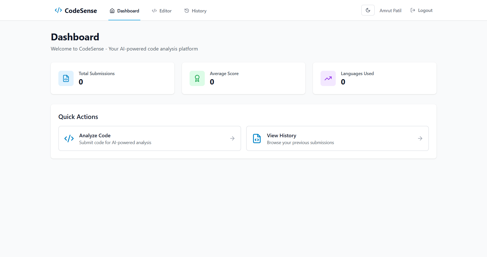

# CodeSense - AI-Powered Code Analysis Platform

<div align="center">


**An intelligent code analysis platform powered by Google Gemini AI**

[](https://opensource.org/licenses/MIT)
[](https://www.typescriptlang.org/)
[](https://reactjs.org/)

</div>

---

## 📸 Screenshots

<div align="center">

### Login Page

*Secure authentication interface for accessing CodeSense*

### Dashboard  

*Comprehensive dashboard showing code analysis statistics and quick actions*

</div>

---

## 🚀 Features

### Core Functionality
- **🔍 Multi-Language Support**: Python, C, C++, Java, and JavaScript
- **⚡ Static Code Analysis**: Automated detection of syntax errors, warnings, and code quality issues
- **🤖 AI-Powered Feedback**: Contextual insights using Google Gemini API for:
  - Performance optimizations
  - Code readability improvements
  - Best practice recommendations
  - Complexity analysis
- **▶️ Code Execution**: Run code safely using Piston API
- **📊 User Dashboard**: Track progress, view statistics, and monitor improvement over time
- **📜 Submission History**: Access and review all previous code analyses

### Technical Highlights
- **Frontend**: React + TypeScript with Monaco Editor for code editing
- **Backend**: Node.js + Express with TypeScript
- **Database**: MongoDB for user data and submission history
- **Authentication**: JWT-based secure authentication with Firebase integration
- **Real-time Analysis**: Parallel processing of static analysis and AI evaluation

---

## 📋 Prerequisites

Before you begin, ensure you have the following installed:

- **Node.js** (v18 or higher) - [Download](https://nodejs.org/)
- **MongoDB** (local or cloud instance) - [Download](https://www.mongodb.com/try/download/community)
- **Google Gemini API key** - [Get API Key](https://makersuite.google.com/app/apikey)
- **npm** or **yarn** package manager

---

## 🛠️ Installation & Setup

### 1. Clone the Repository

```bash
git clone https://github.com/CodeSense-Mini-Project/Mini-Project.git
cd Mini-Project
```

### 2. Install Dependencies

Install all dependencies for root, server, and client:

```bash
npm run install-all
```

Or install manually:

```bash
# Install root dependencies
npm install

# Install server dependencies
cd server
npm install

# Install client dependencies
cd ../client
npm install
```

### 3. Configure Environment Variables

Create a `.env` file in the `server` directory:

```env
PORT=5000
NODE_ENV=development
MONGODB_URI=mongodb://localhost:27017/codesense
JWT_SECRET=your-super-secret-jwt-key-change-this-in-production
GEMINI_API_KEY=your-gemini-api-key-here
PISTON_API_URL=https://emkc.org/api/v2/piston
CORS_ORIGIN=http://localhost:5173
```

### 4. Firebase Configuration

Set up Firebase Authentication:
1. Create a Firebase project at [Firebase Console](https://console.firebase.google.com/)
2. Enable Email/Password authentication
3. Copy your Firebase config to `client/src/firebase/config.ts`

### 5. Start MongoDB

**Local MongoDB:**
```bash
mongod
```

**MongoDB Atlas (Cloud):**
- Create a cluster at [MongoDB Atlas](https://www.mongodb.com/cloud/atlas)
- Update `MONGODB_URI` in `.env` with your connection string

---

## ▶️ Running the Application

### Development Mode (Recommended)

Run both server and client concurrently:

```bash
npm run dev
```

This will start:
- **Backend Server**: `http://localhost:5000`
- **Frontend Client**: `http://localhost:5173`

### Run Separately

**Terminal 1 - Backend:**
```bash
npm run server
# or
cd server
npm run dev
```

**Terminal 2 - Frontend:**
```bash
npm run client
# or
cd client
npm start
```

---

## 📁 Project Structure

```
Mini-Project/
├── client/                 # React frontend application
│   ├── src/
│   │   ├── components/    # Reusable UI components
│   │   │   ├── Navbar.tsx
│   │   │   ├── ErrorBoundary.tsx
│   │   │   └── PrivateRoute.tsx
│   │   ├── contexts/       # React contexts
│   │   │   ├── AuthContext.tsx
│   │   │   └── ThemeContext.tsx
│   │   ├── pages/          # Page components
│   │   │   ├── Login.tsx
│   │   │   ├── Register.tsx
│   │   │   ├── Dashboard.tsx
│   │   │   ├── CodeEditor.tsx
│   │   │   ├── History.tsx
│   │   │   └── SubmissionDetail.tsx
│   │   ├── firebase/       # Firebase configuration
│   │   │   └── config.ts
│   │   ├── App.tsx         # Main app component
│   │   └── main.tsx        # Entry point
│   └── package.json
├── server/                 # Node.js backend server
│   ├── src/
│   │   ├── models/         # MongoDB models
│   │   ├── routes/         # API routes
│   │   │   ├── authRoutes.ts
│   │   │   ├── codeRoutes.ts
│   │   │   └── userRoutes.ts
│   │   ├── services/       # Business logic
│   │   │   ├── codeAnalyzer.ts
│   │   │   ├── geminiService.ts
│   │   │   └── pistonService.ts
│   │   ├── middleware/     # Express middleware
│   │   │   ├── auth.ts
│   │   │   └── errorHandler.ts
│   │   ├── utils/          # Utility functions
│   │   │   └── logger.ts
│   │   └── index.ts        # Server entry point
│   └── package.json
└── package.json            # Root package.json with scripts
```

---

## 🔌 API Endpoints

### Authentication
- `POST /api/auth/register` - Register a new user
- `POST /api/auth/login` - User login and get JWT token

### Code Analysis
- `POST /api/code/analyze` - Analyze code (requires authentication)
  - Request body: `{ code: string, language: string }`
  - Returns: Analysis results with static analysis and AI feedback
- `GET /api/code/history` - Get user's submission history
- `GET /api/code/submission/:id` - Get specific submission details
- `GET /api/code/stats` - Get user statistics (total submissions, average score, etc.)

### User Profile
- `GET /api/user/profile` - Get current user profile information

---

## 🎯 Usage Guide

1. **Register/Login**
   - Create a new account or sign in with existing credentials
   - Authentication is handled securely via Firebase and JWT

2. **Write Code**
   - Navigate to the Code Editor page
   - Use the Monaco Editor (VS Code editor) to write or paste your code
   - Select your programming language from the dropdown

3. **Analyze Code**
   - Click the "Analyze" button to submit your code
   - The system will perform:
     - Static code analysis (syntax checking, error detection)
     - AI-powered analysis (performance, readability, best practices)
     - Code quality scoring

4. **View Results**
   - Review detailed feedback and suggestions
   - Check code quality score and metrics
   - See optimization recommendations

5. **Track Progress**
   - Visit the Dashboard to see statistics
   - View History to browse all previous submissions
   - Monitor your improvement over time

---

## 🔧 Configuration

### Gemini API Setup
1. Visit [Google AI Studio](https://makersuite.google.com/app/apikey)
2. Create a new API key
3. Add it to `server/.env` as `GEMINI_API_KEY`

### MongoDB Setup
**Local Installation:**
- Download and install MongoDB Community Edition
- Start MongoDB service: `mongod`
- Default connection: `mongodb://localhost:27017/codesense`

**MongoDB Atlas (Cloud):**
- Sign up at [MongoDB Atlas](https://www.mongodb.com/cloud/atlas)
- Create a free cluster
- Get connection string and update `MONGODB_URI` in `.env`
- Whitelist your IP address in Atlas network settings

### Firebase Setup
1. Go to [Firebase Console](https://console.firebase.google.com/)
2. Create a new project
3. Enable Authentication → Email/Password
4. Copy Firebase config to `client/src/firebase/config.ts`

---

## 🧪 Technologies Used

### Frontend
- **React 18** - UI library
- **TypeScript** - Type safety
- **Vite** - Build tool and dev server
- **Monaco Editor** - Code editor component
- **Tailwind CSS** - Styling
- **React Router** - Navigation
- **Firebase** - Authentication
- **Axios** - HTTP client
- **Recharts** - Data visualization

### Backend
- **Node.js** - Runtime environment
- **Express** - Web framework
- **TypeScript** - Type safety
- **MongoDB** - Database
- **Mongoose** - ODM for MongoDB
- **JWT** - Authentication tokens
- **Google Gemini API** - AI code analysis
- **Piston API** - Code execution
- **Winston** - Logging

---

## 🚧 Future Enhancements

- [ ] Test case generation and execution
- [ ] Leaderboard system for competitive coding
- [ ] Plagiarism detection
- [ ] GitHub integration for repository analysis
- [ ] Classroom/team collaboration features
- [ ] Advanced code metrics and visualization
- [ ] Export analysis reports (PDF/JSON)
- [ ] Real-time collaborative code editing
- [ ] Support for additional programming languages
- [ ] Customizable analysis rules and preferences

---

## 🤝 Contributing

Contributions are welcome! Please feel free to submit a Pull Request.

1. Fork the repository
2. Create your feature branch (`git checkout -b feature/AmazingFeature`)
3. Commit your changes (`git commit -m 'Add some AmazingFeature'`)
4. Push to the branch (`git push origin feature/AmazingFeature`)
5. Open a Pull Request

---

## 📝 License

This project is licensed under the MIT License - see the LICENSE file for details.

---

## 📧 Support & Contact

For issues, questions, or suggestions:
- Open an issue on [GitHub Issues](https://github.com/CodeSense-Mini-Project/Mini-Project/issues)
- Check the documentation in the project wiki

---

<div align="center">

**Built with ❤️ using React, Node.js, MongoDB, and Google Gemini AI**

⭐ Star this repo if you find it helpful!

</div>